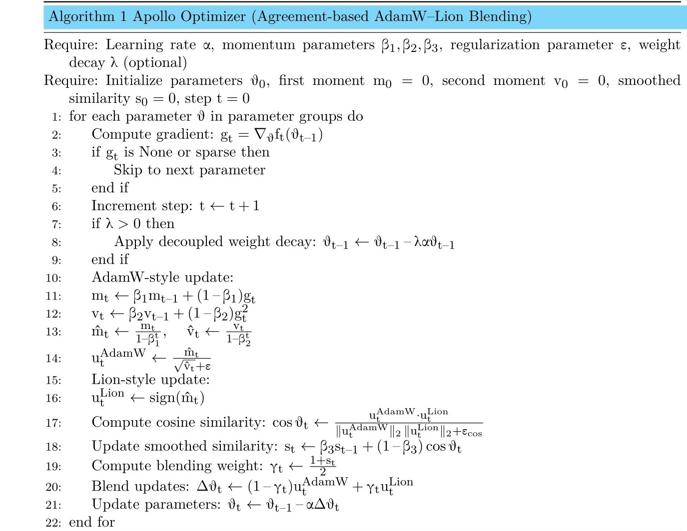

# Apollo-Optimizer
Apollo Optimizer 🚀
Adaptive Policy for Optimizer-space Linear Linking

Apollo is a novel optimization algorithm that dynamically blends the strengths of AdamW and Lion optimizers by automatically adapting the interpolation factor based on update direction agreement.

🌟 Key Features
Dynamic Adaptation: Automatically adjusts the blend ratio between AdamW and Lion updates

Agreement-based Interpolation: Uses cosine similarity to measure consensus between update directions

No Manual Tuning: Eliminates the need for fixed hyperparameter gamma

Memory Efficient: Minimal additional state requirements

Decoupled Weight Decay: AdamW-style weight decay implementation

🧠 How It Works
Apollo operates through a four-step process:

Dual Update Calculation: Computes both AdamW-style (adaptive) and Lion-style (sign-based) updates

Agreement Measurement: Uses cosine similarity to quantify directional consensus

Smoothing: Applies EMA smoothing to the agreement factor for stability

Dynamic Interpolation: Blends updates proportionally to the measured agreement

The adaptive mechanism ensures that when both optimizers agree on the direction, Apollo leans more towards the Lion update (faster convergence), while maintaining AdamW's adaptability when directions diverge.

📊 Mathematical Formulation
For each parameter at step t:

AdamW update: update_adam = m_hat / (√v_hat + ε)

Lion update: update_lion = sign(m_hat)

Agreement factor: γ = (EMA(cosine_similarity) + 1) / 2

Final update: (1 - γ) * update_adam + γ * update_lion





## Code of Apollo Optimizer
```python
# ---------------------------
# CosAdam Optimizer ( Implementation)
# ---------------------------

"""
apollo.py

Implements the Apollo optimizer: Adaptive Policy for Optimizer-space Linear Linking.

Apollo dynamically interpolates between AdamW-style and Lion-style update directions
based on the cosine similarity of their proposed updates. This adaptive interpolation
eliminates the need for a manually tuned fixed mixing coefficient (e.g., gamma).
"""

from typing import Any, Dict, List, Optional, Union

import torch
import torch.nn.functional as F
import torch.optim as optim

__all__ = ['Apollo']


class Apollo(optim.Optimizer):
    r"""Implements the Apollo optimizer.

    Apollo adaptively combines AdamW and Lion update directions by measuring
    the cosine similarity between them and using an exponential moving average (EMA)
    to stabilize the interpolation coefficient. This allows the optimizer to
    automatically favor one strategy over the other depending on gradient behavior.

    The update rule is:

    .. math::
        \text{update} = (1 - \gamma_t) \cdot \text{AdamW-update} + \gamma_t \cdot \text{Lion-update}

    where :math:`\gamma_t` is dynamically computed from the smoothed cosine similarity
    between the two update vectors at step :math:`t`.

    Arguments:
        params: Iterable of parameters to optimize or dicts defining parameter groups.
        lr: Learning rate (default: 1e-3).
        betas: Coefficients for exponential moving averages. Should be a tuple of
            (beta1 for m, beta2 for v, beta3 for agreement EMA) (default: (0.9, 0.999, 0.9)).
        eps: Term added to denominator for numerical stability (default: 1e-8).
        weight_decay: Weight decay (L2 penalty) (default: 1e-2).

    Example:
        >>> import torch
        >>> import torch.nn as nn
        >>> from apollo import Apollo
        >>>
        >>> model = nn.Linear(10, 1)
        >>> optimizer = Apollo(model.parameters(), lr=1e-3)
        >>>
        >>> def closure():
        >>>     optimizer.zero_grad()
        >>>     output = model(torch.randn(1, 10))
        >>>     loss = output.pow(2).sum()
        >>>     loss.backward()
        >>>     return loss
        >>>
        >>> for _ in range(100):
        >>>     loss = optimizer.step(closure)
    """

    def __init__(
        self,
        params: Union[Iterator[torch.nn.Parameter], List[Dict[Any, Any]]],
        lr: float = 1e-3,
        betas: tuple = (0.9, 0.999, 0.9),
        eps: float = 1e-8,
        weight_decay: float = 1e-2,
    ):
        if not 0.0 <= lr:
            raise ValueError(f"Invalid learning rate: {lr}")
        if not 0.0 <= eps:
            raise ValueError(f"Invalid epsilon value: {eps}")
        if not 0.0 <= betas[0] < 1.0:
            raise ValueError(f"Invalid beta_1: {betas[0]}")
        if not 0.0 <= betas[1] < 1.0:
            raise ValueError(f"Invalid beta_2: {betas[1]}")
        if not 0.0 <= betas[2] < 1.0:
            raise ValueError(f"Invalid beta_3 for adaptation: {betas[2]}")
        if not 0.0 <= weight_decay:
            raise ValueError(f"Invalid weight_decay value: {weight_decay}")

        defaults = dict(lr=lr, betas=betas, eps=eps, weight_decay=weight_decay)
        super(Apollo, self).__init__(params, defaults)

    @torch.no_grad()
    def step(self, closure: Optional[Callable[[], torch.Tensor]] = None) -> Optional[torch.Tensor]:
        """Performs a single optimization step.

        Arguments:
            closure: A callable that re-evaluates the model and returns the loss.
                     Optional for most cases.

        Returns:
            loss: Optional loss tensor if closure is provided.
        """
        loss = None
        if closure is not None:
            with torch.enable_grad():
                loss = closure()

        for group in self.param_groups:
            beta1, beta2, beta3 = group['betas']

            for p in group['params']:
                if p.grad is None:
                    continue
                grad = p.grad
                if grad.is_sparse:
                    raise RuntimeError('Apollo does not support sparse gradients.')

                state = self.state[p]

                # Initialize state
                if len(state) == 0:
                    state['step'] = 0
                    state['exp_avg'] = torch.zeros_like(p, memory_format=torch.preserve_format)
                    state['exp_avg_sq'] = torch.zeros_like(p, memory_format=torch.preserve_format)
                    state['update_agreement'] = torch.zeros((), device=p.device)  # scalar

                exp_avg, exp_avg_sq = state['exp_avg'], state['exp_avg_sq']
                state['step'] += 1

                # Decoupled weight decay (AdamW-style)
                if group['weight_decay'] != 0:
                    p.add_(p, alpha=-group['weight_decay'] * group['lr'])

                # Update biased first and second moment estimates
                exp_avg.mul_(beta1).add_(grad, alpha=1 - beta1)
                exp_avg_sq.mul_(beta2).addcmul_(grad, grad, value=1 - beta2)

                # Bias correction
                bias_correction1 = 1 - beta1 ** state['step']
                bias_correction2 = 1 - beta2 ** state['step']

                m_hat = exp_avg / bias_correction1
                v_hat = exp_avg_sq / bias_correction2

                # --- High-Novelty Adaptive Mechanism ---
                # 1. Compute candidate updates
                denom = (v_hat.sqrt() + group['eps'])
                update_adam = m_hat / denom
                update_lion = torch.sign(m_hat)

                # 2. Measure directional agreement via cosine similarity
                cos_sim = F.cosine_similarity(
                    update_adam.flatten(), update_lion.flatten(), dim=0, eps=1e-10
                )

                # 3. Smooth agreement with EMA
                state['update_agreement'].mul_(beta3).add_(cos_sim, alpha=1 - beta3)

                # 4. Map smoothed cosine similarity [-1, 1] → gamma [0, 1]
                gamma = (state['update_agreement'].item() + 1.0) / 2.0

                # Interpolate updates
                final_update = (1 - gamma) * update_adam + gamma * update_lion

                # Apply update
                p.add_(final_update, alpha=-group['lr'])

        return loss
```

[Example Image](Apollo.jpg)
[Example Image](Apollo.jpg)
[Example Image](Apollo.jpg)
[Example Image](Apollo.jpg)
[Example Image](Apollo.jpg)
[Example Image](Apollo.jpg)
[Example Image](Combine.png)


# Apollo Optimizer Performance Analysis

This repository contains performance evaluations of the Apollo optimizer compared to state-of-the-art optimization algorithms across various datasets.

## Results Summary

### MNIST Dataset Performance

| Optimizer | Test Loss | Test Acc | Precision | Recall | F1 | AUC | Specificity | Avg Epoch Time (s) |
|-----------|-----------|----------|-----------|--------|----|-----|-------------|-------------------|
| Apollo | 0.0326 | 0.9933 | 0.9933 | 0.9932 | 0.9932 | 1.0000 | 0.9993 | 16.45 |
| AdaBelief | 0.0358 | 0.9881 | 0.9880 | 0.9880 | 0.9880 | 0.9999 | 0.9987 | 14.12 |
| LAMB | 0.0779 | 0.9751 | 0.9751 | 0.9749 | 0.9750 | 0.9996 | 0.9972 | 15.31 |
| Lion | 0.0378 | 0.9909 | 0.9908 | 0.9908 | 0.9908 | 0.9999 | 0.9990 | 14.23 |
| AdamW | 0.0309 | 0.9902 | 0.9902 | 0.9901 | 0.9901 | 0.9999 | 0.9989 | 15.05 |
| Sophia | 0.1444 | 0.9578 | 0.9574 | 0.9573 | 0.9573 | 0.9984 | 0.9953 | 14.63 |
| Nadam | 0.0318 | 0.9892 | 0.9892 | 0.9891 | 0.9891 | 0.9999 | 0.9988 | 14.17 |
| Adam | 0.0309 | 0.9892 | 0.9892 | 0.9890 | 0.9891 | 0.9999 | 0.9988 | 13.87 |
| RMSprop | 0.0240 | 0.9929 | 0.9928 | 0.9928 | 0.9928 | 1.0000 | 0.9992 | 14.10 |
| SGD | 0.0405 | 0.9872 | 0.9871 | 0.9871 | 0.9871 | 0.9999 | 0.9986 | 14.15 |

### Noisy MNIST Dataset Performance

| Optimizer | Test Loss | Test Acc | Precision | Recall | F1 | AUC | Specificity | Avg Epoch Time (s) |
|-----------|-----------|----------|-----------|--------|----|-----|-------------|-------------------|
| Apollo | 0.0337 | 0.9918 | 0.9918 | 0.9916 | 0.9917 | 1.0000 | 0.9991 | 18.96 |
| AdaBelief | 0.0376 | 0.9880 | 0.9880 | 0.9879 | 0.9879 | 0.9999 | 0.9987 | 17.50 |
| LAMB | 0.0825 | 0.9731 | 0.9730 | 0.9728 | 0.9729 | 0.9995 | 0.9970 | 18.41 |
| Lion | 0.0365 | 0.9917 | 0.9916 | 0.9916 | 0.9916 | 0.9999 | 0.9991 | 17.71 |
| AdamW | 0.0323 | 0.9893 | 0.9893 | 0.9892 | 0.9892 | 0.9999 | 0.9988 | 17.34 |
| Sophia | 0.1489 | 0.9564 | 0.9560 | 0.9558 | 0.9558 | 0.9983 | 0.9952 | 18.76 |
| Nadam | 0.0336 | 0.9890 | 0.9890 | 0.9889 | 0.9889 | 0.9999 | 0.9988 | 17.36 |
| Adam | 0.0327 | 0.9883 | 0.9883 | 0.9881 | 0.9882 | 0.9999 | 0.9987 | 17.20 |
| RMSprop | 0.0262 | 0.9910 | 0.9909 | 0.9908 | 0.9909 | 0.9999 | 0.9990 | 17.21 |
| SGD | 0.0427 | 0.9864 | 0.9863 | 0.9862 | 0.9863 | 0.9999 | 0.9985 | 17.10 |

### SST-2 Dataset Performance

| Optimizer | Test Loss | Test Acc | Precision | Recall | F1 | AUC | Specificity | Avg Epoch Time (s) |
|-----------|-----------|----------|-----------|--------|----|-----|-------------|-------------------|
| Apollo | 0.6567 | 0.8005 | 0.8031 | 0.7995 | 0.7996 | 0.8672 | 0.7500 | 16.19 |
| AdaBelief | 0.7099 | 0.7798 | 0.8024 | 0.7773 | 0.7745 | 0.8692 | 0.6379 | 15.23 |
| LAMB | 0.8071 | 0.8154 | 0.8173 | 0.8146 | 0.8148 | 0.8810 | 0.7734 | 16.70 |
| Lion | 0.6759 | 0.7936 | 0.7980 | 0.7924 | 0.7923 | 0.8646 | 0.7290 | 14.97 |
| AdamW | 0.5116 | 0.8257 | 0.8256 | 0.8257 | 0.8257 | 0.8931 | 0.8271 | 15.40 |
| Sophia | 0.6023 | 0.6950 | 0.7168 | 0.6919 | 0.6849 | 0.7751 | 0.5257 | 15.40 |
| Nadam | 0.4403 | 0.7993 | 0.8024 | 0.7983 | 0.7984 | 0.8809 | 0.7453 | 15.22 |
| Adam | 0.4434 | 0.7947 | 0.7986 | 0.7936 | 0.7936 | 0.8798 | 0.7336 | 15.41 |
| RMSprop | 0.4422 | 0.7993 | 0.8011 | 0.7985 | 0.7987 | 0.8787 | 0.7570 | 15.32 |
| SGD | 0.6841 | 0.5229 | 0.5621 | 0.5149 | 0.4052 | 0.6391 | 0.0794 | 15.10 |

### AG News Dataset Performance

| Optimizer | Test Loss | Test Acc | Precision | Recall | F1 | AUC | Specificity | Avg Epoch Time (s) |
|-----------|-----------|----------|-----------|--------|----|-----|-------------|-------------------|
| Apollo | 0.2672 | 0.9184 | 0.9184 | 0.9184 | 0.9183 | 0.9851 | 0.9728 | 3.99 |
| AdaBelief | 0.3092 | 0.9025 | 0.9023 | 0.9025 | 0.9023 | 0.9799 | 0.9675 | 3.07 |
| LAMB | 0.2692 | 0.9158 | 0.9156 | 0.9158 | 0.9157 | 0.9844 | 0.9719 | 3.52 |
| Lion | 0.3195 | 0.9132 | 0.9131 | 0.9132 | 0.9131 | 0.9843 | 0.9711 | 2.63 |
| AdamW | 0.2935 | 0.9047 | 0.9047 | 0.9047 | 0.9046 | 0.9816 | 0.9682 | 2.83 |
| Sophia | 1.2491 | 0.6521 | 0.6560 | 0.6521 | 0.6495 | 0.8520 | 0.8840 | 2.89 |
| Nadam | 0.5049 | 0.8554 | 0.8555 | 0.8554 | 0.8550 | 0.9664 | 0.9518 | 3.04 |
| Adam | 0.5046 | 0.8576 | 0.8578 | 0.8576 | 0.8572 | 0.9665 | 0.9525 | 3.02 |
| RMSprop | 0.4603 | 0.8658 | 0.8659 | 0.8658 | 0.8654 | 0.9697 | 0.9553 | 2.71 |
| SGD | 1.3489 | 0.4687 | 0.4696 | 0.4687 | 0.4681 | 0.7164 | 0.8229 | 2.46 |

### IMDB Dataset Performance

| Optimizer | Test Loss | Test Acc | Precision | Recall | F1 | AUC | Specificity | Avg Epoch Time (s) |
|-----------|-----------|----------|-----------|--------|----|-----|-------------|-------------------|
| Apollo | 0.3084 | 0.8830 | 0.8832 | 0.8830 | 0.8829 | 0.9453 | 0.8959 | 1.36 |
| AdaBelief | 0.3808 | 0.8576 | 0.8576 | 0.8576 | 0.8576 | 0.9256 | 0.8606 | 1.19 |
| LAMB | 0.3328 | 0.8695 | 0.8695 | 0.8695 | 0.8695 | 0.9355 | 0.8700 | 1.46 |
| Lion | 0.3818 | 0.8712 | 0.8716 | 0.8712 | 0.8712 | 0.9353 | 0.8868 | 1.10 |
| AdamW | 0.3479 | 0.8681 | 0.8682 | 0.8681 | 0.8681 | 0.9350 | 0.8757 | 1.13 |
| Sophia | 0.6822 | 0.6210 | 0.6211 | 0.6210 | 0.6210 | 0.6655 | 0.6318 | 1.14 |
| Nadam | 0.5920 | 0.7320 | 0.7320 | 0.7320 | 0.7319 | 0.7999 | 0.7402 | 1.16 |
| Adam | 0.5955 | 0.7301 | 0.7303 | 0.7301 | 0.7301 | 0.7965 | 0.7422 | 1.13 |
| RMSprop | 0.5719 | 0.7488 | 0.7489 | 0.7488 | 0.7488 | 0.8189 | 0.7594 | 1.09 |
| SGD | 0.6919 | 0.5245 | 0.5247 | 0.5245 | 0.5235 | 0.5392 | 0.5704 | 1.06 |

### SVHN Dataset Performance

| Optimizer | Test Loss | Test Acc | Precision | Recall | F1 | AUC | Specificity | Avg Epoch Time (s) |
|-----------|-----------|----------|-----------|--------|----|-----|-------------|-------------------|
| Apollo | 0.1672 | 0.9544 | 0.9515 | 0.9519 | 0.9516 | 0.9969 | 0.9949 | 76.86 |
| AdaBelief | 0.1605 | 0.9562 | 0.9546 | 0.9529 | 0.9537 | 0.9971 | 0.9950 | 73.60 |
| LAMB | 0.1877 | 0.9482 | 0.9442 | 0.9449 | 0.9444 | 0.9965 | 0.9942 | 79.87 |
| Lion | 0.1634 | 0.9563 | 0.9545 | 0.9535 | 0.9540 | 0.9970 | 0.9951 | 72.32 |
| AdamW | 0.1648 | 0.9547 | 0.9525 | 0.9519 | 0.9522 | 0.9971 | 0.9949 | 72.60 |
| Sophia | 0.1823 | 0.9482 | 0.9462 | 0.9455 | 0.9458 | 0.9967 | 0.9941 | 72.84 |
| Nadam | 0.1535 | 0.9576 | 0.9551 | 0.9569 | 0.9560 | 0.9972 | 0.9952 | 72.83 |
| Adam | 0.1560 | 0.9571 | 0.9553 | 0.9550 | 0.9551 | 0.9971 | 0.9952 | 72.40 |
| RMSprop | 0.1709 | 0.9528 | 0.9500 | 0.9509 | 0.9503 | 0.9969 | 0.9947 | 71.85 |
| SGD | 0.5677 | 0.8168 | 0.8070 | 0.7980 | 0.8009 | 0.9782 | 0.9794 | 71.61 |

### Apollo Hyperparameter Tuning on CIFAR-10

| Configuration | Accuracy | F1-Score | AUC | Time/Epoch |
|---------------|----------|----------|-----|------------|
| lr=0.0005 | **0.8708** | 0.8709 | 0.9907 | 25.68 s |
| Default (β₃=0.9) | 0.8700 | 0.8700 | 0.9901 | 26.09 s |
| β₃=0.75 | 0.8677 | 0.8672 | 0.9894 | 25.69 s |
| weight decay=0.05 | 0.8672 | 0.8668 | 0.9892 | 24.29 s |
| β₁=0.85, β₂=0.999 | 0.8665 | 0.8661 | 0.9900 | 24.60 s |
| β₃=0.5 | 0.8659 | 0.8655 | 0.9895 | 25.64 s |
| β₃=0.0 | 0.8642 | 0.8641 | 0.9892 | 25.48 s |
| β₁=0.9, β₂=0.99 | 0.8625 | 0.8622 | 0.9892 | 24.60 s |
| weight decay=0.0 | 0.8608 | 0.8603 | 0.9889 | 24.52 s |
| lr=0.005 | 0.8139 | 0.8131 | 0.9815 | 25.27 s |
| **Mean ± Std** | 0.8640 ± 0.017 | 0.8638 ± 0.017 | 0.9891 ± 0.0029 | 25.42 ± 0.58 s |

*Default configuration: lr=0.001, β₁=0.9, β₂=0.999, β₃=0.9, wd=0.01, eps=1e-8*

## Key Findings

1. **MNIST Performance**: Apollo achieves the highest accuracy (99.33%) on the standard MNIST dataset
2. **Noisy Data Robustness**: Apollo maintains strong performance on noisy MNIST data
3. **Text Classification**: Apollo shows competitive performance on NLP tasks (SST-2, AG News, IMDB)
4. **Image Recognition**: On SVHN, Apollo performs competitively with other top optimizers
5. **Hyperparameter Sensitivity**: The learning rate has the most significant impact on Apollo's performance

## Usage

To use the Apollo optimizer in your projects:

```python
# PyTorch implementation
optimizer = Apollo(model.parameters(), lr=0.001, beta1=0.9, beta2=0.999, beta3=0.9, weight_decay=0.01, eps=1e-8)
